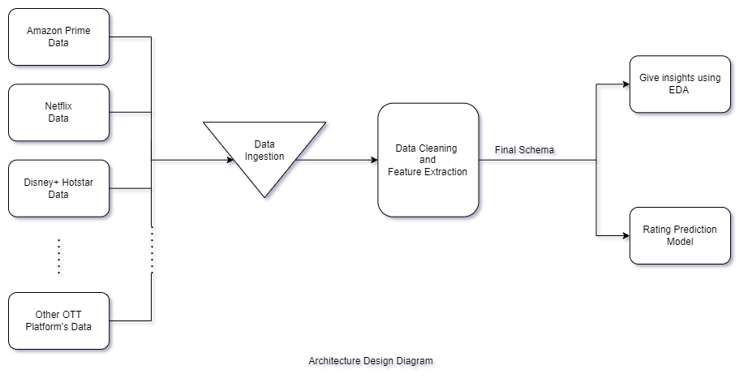

# Content Diversification through EDA on OTT Platforms  

## Short Description

### What's the problem?
The way we consume videos nowadays has undergone massive changes. Now we have multiple OTT platforms such as Netflix, Amazon Prime Video, Disney+ Hotsar, etc. to stream TV shows and movies online. With an overabundance of information and multiple criteria to compare various OTT platforms, it has become increasingly difficult for users to find the best fit for their taste. This is referred to as "choice paralysis" which is causing loss to ott streaming services and is also disappointing to users in search of quality entertainment programs. 

### How can the technology help?
We analyze data and content from some of the major OTT platforms. This data is further analysed to generate valuable insights that would help content creators in deciding which shows/movies to produce or add on their platforms. Adding more popular content on their feed will result into better user engagement and increased subscription rate. This solution can also be embedded into customer churn prediction model to help increase user retention by recommending customised content. 
	
### The Idea
The idea is to extract data from various ott platforms to derive meaningful insights based on various fields like genre, ratings, revenues, release year etc. In future, these insights can serve as an input to a prediction model. This model will suggest content creators with most trending creative ideas to achieve best imdb rating and most suitable platform for their content. Furthermore, it can be made available to all through a public platform.

